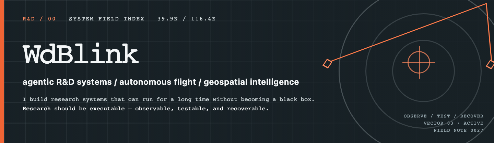

  

I build research systems that can run for a long time without becoming a black box.

> **Research should be executable:** observable, testable, and recoverable.

## 01 / Research coordinates

<table>
  <tr>
    <td width="33%"><code>X / SYSTEMS</code> <strong>Agentic R&amp;D systems</strong> Long-horizon agents, evaluator gates, multi-agent harnesses, recovery protocols, and token economics.</td>
    <td width="34%"><code>Y / AUTONOMY</code> <strong>Autonomous flight &amp; RL</strong> Fixed-wing control, visual localization, sensor fusion, simulation, and reinforcement-learning navigation.</td>
    <td width="33%"><code>Z / EARTH</code> <strong>Geospatial vision &amp; data</strong> Remote-sensing pipelines, multimodal perception, dataset generation, and map-to-model tools.</td>
  </tr>
</table>

## 02 / Selected active work

<table>
  <tr>
    <td width="50%"><a href="https://github.com/WdBlink/token-firewall-team"><code>token-firewall-team</code></a> Delegates implementation to lower-cost workers and reserves frontier-model tokens for bounded review, with reproducible evaluation evidence.</td>
    <td width="50%"><a href="https://github.com/WdBlink/autoresearch-paper"><code>autoresearch-paper</code></a> Runs long-horizon paper projects with frozen evaluators, research gates, watchdogs, and resumable state.</td>
  </tr>
  <tr>
    <td><a href="https://github.com/WdBlink/daily-cockpit"><code>daily-cockpit</code></a> A local-first Obsidian workspace that protects today, captures ideas without pressure, and reconnects yesterday's context.</td>
    <td><a href="https://github.com/WdBlink/codein"><code>codein</code></a> Runs Codex from an Obsidian sidebar through the local CLI, with explicit model, reasoning, and file-access controls.</td>
  </tr>
  <tr>
    <td><a href="https://github.com/WdBlink/pilot_rl_navigation"><code>pilot_rl_navigation</code></a> Explores drone navigation through visual positioning, sensor fusion, reinforcement learning, and recovery control.</td>
    <td><a href="https://github.com/WdBlink/RSDatasetGenerator"><code>RSDatasetGenerator</code></a> Turns geospatial vector points into remote-sensing image datasets with tiled downloads and pixel-coordinate metadata.</td>
  </tr>
</table>

## 03 / Now

Long-horizon agent evaluation, UAV agent harnesses, and knowledge systems that maintain themselves.

## 04 / Toolbox + contact

[`LLM-Skills`](https://github.com/WdBlink/LLM-Skills) · [`ztrade-ares-7x24`](https://github.com/WdBlink/ztrade-ares-7x24) research sandbox 
[Field notes](https://wdblink.github.io/) · [ORCID](https://orcid.org/0000-0001-7979-0436)
